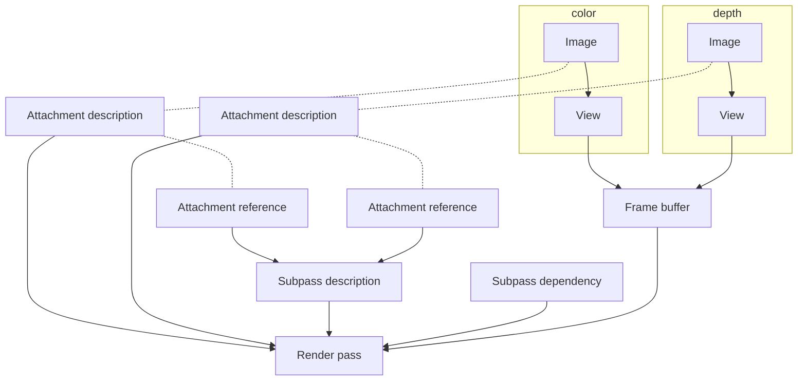

```mermaid
graph TD

0["View"]
1["View"]
2["Frame buffer"]
3["Attachment description"]
4["Attachment reference"]
5["Attachment description"]
6["Attachment reference"]

subgraph color
I0["Image"]-->0
end

0-->2
I0 -.- 3
3 -.- 4

subgraph depth
I1["Image"]-->1
end

1-->2
I1 -.- 5
5 -.- 6

7["Subpass description"]
8["Subpass dependency"]
9["Render pass"]

4-->7
6-->7

3-->9
5-->9
7-->9
8-->9
2-->9
```
